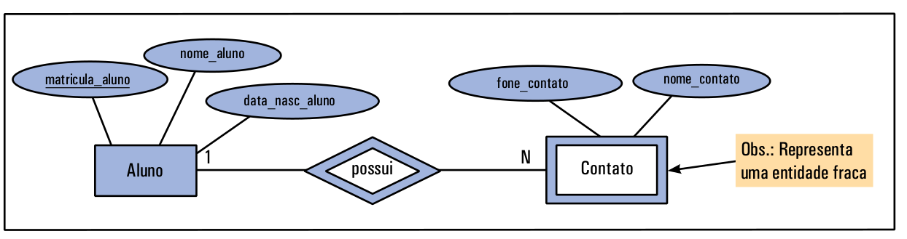

# Entidade Fraca

Entidade Fraca é um tipo de entidade que não possui atributo chave primária por si só. Isso significa que não é possível definir uma chave primária, nem simples e nem composta, para a entidade.

Além disso, uma entidade fraca é dependente de uma outra entidade, e o relacionamento entre a entidade fraca e a outra entidade é normalmente 1:N, e o N fica junto à entidade fraca.

A entidade **Contato** da figura é uma entidade fraca porque não possui um atributo (ou conjunto de atributos) que identifique um único objeto. Assim, ela é dependente da entidade **Aluno**, porque só existe um contato se houver o aluno para aquele contato. Finalmente, o relacionamento entre as duas entidades (**Aluno** e **Contato**) é 1:N, ou seja, um aluno pode ter vários contatos, mas um contato pertence a apenas um aluno.

Livros de banco de dados, geralmente, representam a entidade fraca por um retângulo duplo e o relacionamento entre a entidade fraca e a outra entidade por losango duplo.

